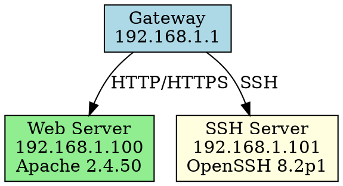

# r3cond0g (RECONRAPTOR) 🦅
### *Hunt. Scan. Conquer.*

<div align="center">
  
[](https://github.com/0xb0rn3/r3cond0g)
[](https://golang.org)
[](LICENSE)
[](https://github.com/0xb0rn3/r3cond0g/actions)

**Developed by:** [0xb0rn3](https://github.com/0xb0rn3) & [0xbv1](https://instagram.com/theehiv3) 

*A lightning-fast, multi-threaded network reconnaissance tool engineered for modern penetration testing and security assessments.*

[🚀 Quick Start](#-quick-start) • [📖 Documentation](#-usage) • [🛠️ Installation](#-installation) • [🤝 Contributing](#-contributing)

</div>

---

## 🎯 **What is RECONRAPTOR?**

RECONRAPTOR is a cutting-edge network reconnaissance framework built in Go that combines speed, precision, and intelligence. Unlike traditional scanning tools, RECONRAPTOR integrates advanced vulnerability mapping, network topology generation, and multi-format reporting into a single, powerful platform designed for security professionals who demand both performance and comprehensive results.

### 🔥 **Why Choose RECONRAPTOR?**

Modern networks require modern tools. RECONRAPTOR addresses the limitations of legacy scanners by providing a unified platform that not only discovers services but intelligently maps vulnerabilities and generates actionable intelligence for security assessments.

---

## ⚡ **Core Capabilities**

<table>
<tr>
<td width="50%">

### 🚀 **Ultra-Performance Scanning**
- **Multi-threaded Architecture**: Concurrent TCP/UDP port scanning
- **Intelligent Optimization**: Prioritizes common ports for faster results  
- **Configurable Concurrency**: Customize thread count for optimal performance
- **Smart Timeouts**: Adaptive timeout handling for various network conditions

### 🔬 **Advanced Intelligence Gathering**
- **Service Fingerprinting**: Deep service detection and version identification
- **OS Detection**: Intelligent operating system identification
- **Banner Grabbing**: Comprehensive service banner analysis
- **Protocol Analysis**: Multi-protocol support and analysis

</td>
<td width="50%">

### 🛡️ **Vulnerability Intelligence**
- **NVD Integration**: Real-time CVE lookup using NVD API 2.0
- **Custom CVE Plugins**: Support for private vulnerability databases
- **Automated Mapping**: Links discovered services to known vulnerabilities
- **Risk Assessment**: Contextual vulnerability scoring and prioritization

### 🗺️ **Network Topology & Visualization**
- **Topology Generation**: Creates network maps in DOT format
- **Graphviz Compatibility**: Professional network diagrams
- **Relationship Mapping**: Visualizes network interconnections
- **Export Flexibility**: Multiple visualization output formats

</td>
</tr>
</table>

---

## 🎯 **Target Flexibility**

RECONRAPTOR adapts to your reconnaissance needs with comprehensive targeting options:

**Single Host Scanning**: `./r3cond0g -target 192.168.1.1`

**CIDR Range Scanning**: `./r3cond0g -target 192.168.1.0/24`  

**Multiple Targets**: `./r3cond0g -target 10.0.0.1,172.16.0.1,192.168.1.1`

**File-Based Targeting**: `./r3cond0g -target-file targets.txt`

**Nmap Integration**: `./r3cond0g -nmap-file scan_results.xml`

---

## 🚀 **Quick Start**

### **Automated Setup (Recommended)**

Our intelligent runner scripts handle everything from dependency management to compilation and execution. These cross-platform automation tools ensure a seamless setup experience regardless of your operating system.

#### **Linux & macOS Setup**
```bash
# Clone the repository
git clone https://github.com/0xb0rn3/r3cond0g.git
cd r3cond0g

# Execute the automated setup
chmod +x run && ./run
```

#### **Windows Setup (PowerShell)**

For Windows users, we provide two convenient deployment methods:

**One-Line Remote Execution** (Fastest Method):
```powershell
irm https://raw.githubusercontent.com/0xb0rn3/r3cond0g/main/run.ps1 | iex
```

**Local Clone and Execute**:
```powershell
git clone https://github.com/0xb0rn3/r3cond0g.git
cd r3cond0g
.\run.ps1
```

The PowerShell runner script represents a sophisticated automation solution that transforms the installation experience on Windows systems. This isn't just a simple build script—it's an intelligent environment management system that handles complex dependency resolution, version control, and deployment workflows.

### **Enhanced Windows Runner Features**

The PowerShell automation script (`run.ps1`) incorporates enterprise-grade features designed for professional security environments:

**Intelligent Dependency Resolution**: The script automatically detects missing dependencies (Git and Go) and attempts installation through multiple package managers. It first tries Windows Package Manager (winget) for modern Windows 10/11 systems, then falls back to Chocolatey if available. This multi-layered approach ensures maximum compatibility across different Windows configurations.

**Smart Update Management**: Rather than forcing users to manually check for updates, the runner implements a time-based update checking system. It maintains a timestamp file (`.last_update_check`) and only queries the remote repository when the configured interval has elapsed. This reduces unnecessary network traffic while ensuring users stay current with security patches and feature updates.

**Advanced Compilation Intelligence**: The script doesn't blindly recompile the binary every time. Instead, it performs file modification time comparisons between source files (`*.go`, `go.mod`, `go.sum`) and the existing executable. This means faster startup times for users who haven't modified the codebase, while ensuring that any changes are properly compiled.

**Professional User Experience**: The script provides rich, color-coded console output with progress indicators, status messages, and clear error reporting. Each operation category (INFO, SUCCESS, ERROR, WARNING, UPDATE) uses distinct visual styling to help users quickly understand what's happening during the setup process.

### **Runner Command Reference**

Both platform runners support identical command-line options for consistent cross-platform workflows:

```bash
# Linux/macOS Options
./run --help                    # Display comprehensive help information
./run --force-update-check      # Bypass time interval and check for updates immediately
./run --skip-update-check       # Skip update verification for this execution
./run --rebuild                 # Force complete recompilation regardless of file timestamps

# Windows PowerShell Options (Identical Functionality)
.\run.ps1 -Help                 # Display comprehensive help information
.\run.ps1 -ForceUpdateCheck     # Bypass time interval and check for updates immediately
.\run.ps1 -SkipUpdateCheck      # Skip update verification for this execution
.\run.ps1 -Rebuild              # Force complete recompilation regardless of file timestamps
```

The consistency between platforms means that security teams can develop standardized deployment procedures that work identically across heterogeneous environments. Whether you're deploying on a Linux penetration testing distribution, a macOS development machine, or a Windows security workstation, the command syntax and behavior remain constant.

### **Understanding the Automation Workflow**

When you execute either runner script, it performs a sophisticated multi-stage workflow designed to ensure reliable, repeatable deployments:

**Stage 1: Environment Validation**: The script first checks for required system dependencies. On Windows, this includes testing for Git and Go installations, and if they're missing, attempting automatic installation through system package managers. The script intelligently handles PATH environment variable updates and can even refresh the current session's environment without requiring a system restart.

**Stage 2: Repository Management**: If you're using the one-line remote execution method, the script automatically clones the repository to your local system. For local executions, it validates that you're in the correct directory structure and that essential files like `main.go` and `go.mod` are present.

**Stage 3: Update Intelligence**: Unless explicitly skipped, the script performs git-based update checking by comparing local and remote commit hashes. If updates are available, it presents a clear prompt asking whether to apply them. The update process includes automatic script restart functionality, ensuring that any improvements to the runner itself are immediately available.

**Stage 4: Go Module Management**: The script initializes Go modules if necessary and runs `go mod tidy` to ensure all dependencies are properly resolved. It even includes proactive dependency management, pre-fetching common packages that might be required during compilation.

**Stage 5: Intelligent Compilation**: Before compiling, the script analyzes file modification timestamps to determine if recompilation is actually necessary. When compilation does occur, it uses optimization flags (`-ldflags="-s -w"`) to produce smaller, more efficient binaries by stripping symbol tables and debug information.

**Stage 6: Execution Handoff**: Finally, the script launches the compiled RECONRAPTOR binary, passing through any command-line arguments you provided to the runner itself.

### **Manual Installation**

For users who prefer granular control over the installation process or are working in environments where automated scripts aren't permitted:

```bash
# Verify Go installation and version compatibility
go version  # Should show Go 1.18 or higher

# Clone the repository and navigate to project directory
git clone https://github.com/0xb0rn3/r3cond0g.git
cd r3cond0g

# Initialize Go module (if not already present)
go mod init r3cond0g

# Download and organize dependencies
go mod tidy

# Compile with optimization flags for production use
go build -ldflags="-s -w" -o r3cond0g main.go

# For Windows users, compile to executable
go build -ldflags="-s -w" -o r3cond0g.exe main.go

# Launch RECONRAPTOR
./r3cond0g        # Linux/macOS
.\r3cond0g.exe    # Windows
```

The manual installation process gives you complete visibility into each step and allows for customization of build flags, output locations, and dependency management. This approach is particularly valuable for security-conscious environments where automated scripts must be reviewed before execution.

---

## 📖 **Usage**

### **Interactive Mode**

RECONRAPTOR features an intuitive menu-driven interface that accommodates both newcomers to network reconnaissance and seasoned penetration testers who need quick access to advanced features:

```
🦅 RECONRAPTOR v0.2.2 - Network Reconnaissance Suite

1. 🚀 Execute Ultra-Fast Scan
2. ⚙️  Configure Scan Parameters  
3. 📊 Display Current Results
4. 💾 Save Results (JSON Format)
5. 📄 Import Nmap XML Results
6. 🔍 Perform Vulnerability Analysis
7. 🗺️  Generate Network Topology
8. 📤 Export Multi-Format Reports
9. ❌ Exit Application
```

The interactive interface provides guided workflows that help users understand the relationship between different reconnaissance phases. For example, you might start with a quick port scan, then move to vulnerability analysis, and finally generate network topology maps—all through an intuitive menu system that explains each option's purpose and expected outcomes.

### **Command Line Interface**

For automation, integration into security testing pipelines, and scenarios where scripted execution is required:

```bash
# Comprehensive security assessment with full vulnerability mapping
./r3cond0g -target 192.168.1.0/24 -ports 1-65535 -vuln -nvd-key YOUR_API_KEY

# Rapid reconnaissance focusing on common service ports
./r3cond0g -target example.com -ports 80,443,22,21,25,53,110,995 -timeout 5000

# UDP service discovery for network infrastructure mapping
./r3cond0g -target 10.0.0.1 -udp -ports 53,67,68,69,123,161,162

# Analysis and enhancement of existing Nmap scan results
./r3cond0g -nmap-file previous_scan.xml -vuln -output enhanced_analysis_report

# Multi-target assessment with custom configuration
./r3cond0g -target-file targets.txt -concurrency 50 -timeout 3000 -output batch_scan
```

The command-line interface supports complex parameter combinations, allowing security professionals to craft precise scanning strategies tailored to specific assessment requirements. Parameters can be combined to create scanning profiles that balance speed, thoroughness, and network impact based on the testing environment and objectives.

### **Advanced Configuration Parameters**

Understanding RECONRAPTOR's configuration options enables you to optimize performance and results for your specific use cases:

| Parameter | Purpose | Example Values | Usage Notes |
|-----------|---------|----------------|-------------|
| `-target` | Primary target specification | `192.168.1.0/24`, `example.com`, `10.0.0.1` | Supports single IPs, hostnames, CIDR ranges, and comma-separated lists |
| `-target-file` | Batch target processing | `targets.txt`, `scope.list` | One target per line, supports comments with # |
| `-ports` | Port scope definition | `1-1000`, `80,443,22`, `top-1000` | Ranges, specific ports, or predefined sets |
| `-timeout` | Connection timeout control | `5000`, `10000` | Milliseconds; adjust based on network latency |
| `-concurrency` | Parallel connection limit | `100`, `50`, `200` | Balance between speed and system resources |
| `-udp` | UDP protocol scanning | Boolean flag | Essential for discovering UDP services like DNS, DHCP |
| `-vuln` | Vulnerability assessment | Boolean flag | Requires NVD API key for comprehensive results |
| `-nvd-key` | CVE database access | `your-api-key-here` | Obtain free key from NVD website |
| `-output` | Report file basename | `security_assessment`, `client_scan` | Creates multiple formats with this base name |

The parameter system is designed to be intuitive while providing the flexibility needed for professional security assessments. For instance, combining `-vuln` with `-nvd-key` enables comprehensive vulnerability correlation, while adjusting `-concurrency` and `-timeout` allows optimization for different network conditions.

---

## 🔧 **Configuration & Setup**

### **NVD API Integration**

The National Vulnerability Database integration transforms RECONRAPTOR from a simple port scanner into a comprehensive vulnerability assessment platform. Here's how to properly configure and utilize this powerful feature:

**Obtaining Your API Key**: Visit the [National Vulnerability Database API Request Page](https://nvd.nist.gov/developers/request-an-api-key) and submit a request for a free API key. The process typically takes 24-48 hours for approval, and the key provides access to the most current vulnerability data available.

**Configuration Methods**:

**Environment Variable Approach** (Recommended for Security):
```bash
# Linux/macOS
export NVD_API_KEY="your-nvd-api-key-here"
./r3cond0g -vuln

# Windows PowerShell
$env:NVD_API_KEY="your-nvd-api-key-here"
.\r3cond0g.exe -vuln

# Windows Command Prompt
set NVD_API_KEY=your-nvd-api-key-here
r3cond0g.exe -vuln
```

**Command Line Parameter**:
```bash
./r3cond0g -nvd-key "your-nvd-api-key-here" -vuln -target 192.168.1.0/24
```

**Interactive Configuration**:
```bash
./r3cond0g
# Select option 2: Configure Scan Parameters
# Follow prompts to enter and save your API key
```

The environment variable approach is recommended for security reasons because it prevents your API key from appearing in command history or process lists visible to other users on shared systems.

### **Custom CVE Database Integration**

For organizations with private vulnerability databases or specialized threat intelligence, RECONRAPTOR supports custom CVE data integration through JSON formatting:

```json
{
  "Apache httpd 2.4.50": ["CVE-2021-41773", "CVE-2021-42013"],
  "OpenSSH 8.2p1": ["CVE-2020-15778", "CVE-2020-14145"],
  "nginx 1.18.0": ["CVE-2021-23017"],
  "Microsoft IIS 10.0": ["CVE-2021-31207", "CVE-2021-31166"],
  "Tomcat 9.0.45": ["CVE-2021-25122", "CVE-2021-25329"]
}
```

To integrate custom vulnerability data:
```bash
./r3cond0g -cve-plugin custom_vulnerabilities.json -target example.com
```

This feature is particularly valuable for organizations that maintain internal vulnerability databases, use commercial threat intelligence feeds, or need to incorporate zero-day vulnerability information that hasn't yet been published to public databases.

### **Performance Optimization Guidelines**

RECONRAPTOR's performance can be fine-tuned based on your specific scanning environment and requirements:

**Network-Constrained Environments**:
```bash
# Reduce concurrency and increase timeout for unstable networks
./r3cond0g -target 10.0.0.0/16 -concurrency 25 -timeout 8000
```

**High-Performance Scanning**:
```bash
# Maximize speed on stable, high-bandwidth networks
./r3cond0g -target 192.168.1.0/24 -concurrency 500 -timeout 2000
```

**Stealth Scanning**:
```bash
# Minimize network footprint for covert reconnaissance
./r3cond0g -target example.com -concurrency 5 -timeout 15000 -ports 80,443,22
```

Understanding these optimization parameters helps you balance scanning speed, network impact, and detection avoidance based on your specific assessment requirements and constraints.

---

## 📊 **Output & Reporting**

RECONRAPTOR's multi-format reporting system ensures that scan results integrate seamlessly into various security workflows and documentation requirements:

### **Real-time Console Output**

The console interface provides immediate feedback during scanning operations with several sophisticated features:

**Progress Visualization**: Dynamic progress bars show completion status for different scanning phases, with estimated time remaining calculations based on current scanning velocity.

**Live Results Display**: As services are discovered, they appear immediately in formatted tables showing host, port, service, version, and status information.

**Performance Metrics**: Real-time statistics display current scanning rate (ports per second), network response times, and resource utilization to help optimize scanning parameters.

**Color-Coded Status**: Different colors indicate various result types—green for open ports, red for security concerns, yellow for warnings, and blue for informational messages.

### **Structured Data Export Formats**

**JSON Output** (Primary format for programmatic analysis):
```json
{
  "scan_metadata": {
    "start_time": "2024-01-15T10:30:00Z",
    "end_time": "2024-01-15T10:45:30Z",
    "scan_duration": "15m30s",
    "targets_scanned": 254,
    "ports_checked": 1000
  },
  "results": [
    {
      "host": "192.168.1.100",
      "hostname": "webserver.local",
      "ports": [
        {
          "port": 80,
          "protocol": "tcp",
          "state": "open",
          "service": "http",
          "version": "Apache httpd 2.4.50",
          "vulnerabilities": ["CVE-2021-41773", "CVE-2021-42013"]
        }
      ]
    }
  ]
}
```

**CSV Export** (Spreadsheet-compatible for data analysis):
```csv
Host,Port,Protocol,State,Service,Version,Vulnerabilities
192.168.1.100,80,tcp,open,http,Apache httpd 2.4.50,"CVE-2021-41773,CVE-2021-42013"
192.168.1.100,443,tcp,open,https,Apache httpd 2.4.50,CVE-2021-41773
192.168.1.101,22,tcp,open,ssh,OpenSSH 8.2p1,CVE-2020-15778
```

**XML Format** (Compatible with security tool integration):
```xml
<?xml version="1.0" encoding="UTF-8"?>
<reconraptor_scan>
  <scan_info start_time="2024-01-15T10:30:00Z" duration="15m30s"/>
  <host ip="192.168.1.100" hostname="webserver.local">
    <port number="80" protocol="tcp" state="open">
      <service name="http" version="Apache httpd 2.4.50"/>
      <vulnerabilities>
        <cve id="CVE-2021-41773" severity="critical"/>
        <cve id="CVE-2021-42013" severity="critical"/>
      </vulnerabilities>
    </port>
  </host>
</reconraptor_scan>
```

**HTML Reports** (Professional presentation format):
RECONRAPTOR generates comprehensive HTML reports with embedded CSS styling, interactive tables, vulnerability summaries, and executive dashboards suitable for client presentations and management reporting.

### **Network Topology Visualization**

**DOT File Generation**: RECONRAPTOR creates Graphviz-compatible DOT files that represent discovered network relationships, service dependencies, and security boundaries:



**Rendering Network Diagrams**: Convert DOT files to visual formats using Graphviz:
```bash
# Generate PNG network diagram
dot -Tpng network_topology.dot -o network_map.png

# Create SVG for web integration
dot -Tsvg network_topology.dot -o network_map.svg

# Generate PDF for reports
dot -Tpdf network_topology.dot -o network_map.pdf
```

These visualizations help security teams understand network architecture, identify critical paths, and communicate findings to stakeholders who may not be technically oriented.

---

## 🛡️ **Security & Compliance**

### **Ethical Usage Framework**

RECONRAPTOR is engineered exclusively for authorized security testing and educational purposes. The tool's capabilities require responsible usage within appropriate legal and ethical boundaries:

**Legal Authorization Requirements**: Before conducting any network reconnaissance, users must obtain explicit written authorization from network owners. This includes corporate environments, cloud infrastructures, and any systems not directly owned or controlled by the user. Unauthorized network scanning may constitute criminal activity under various jurisdictions' computer crime laws.

**Professional Engagement Scope**: Use RECONRAPTOR only within the defined scope of authorized penetration testing engagements, security assessments, vulnerability research, or approved educational activities. Document all scanning activities and maintain detailed logs for compliance and audit purposes.

**Responsible Disclosure Practices**: When vulnerabilities are discovered during authorized testing, follow established responsible disclosure protocols. Coordinate with system owners to ensure vulnerabilities are properly reported, tracked, and remediated before any public disclosure.

### **Compliance Integration**

Organizations deploying RECONRAPTOR should ensure alignment with relevant security frameworks and regulatory requirements:

**NIST Cybersecurity Framework Alignment**: RECONRAPTOR supports the "Identify" function by helping organizations understand their network assets and vulnerabilities. Use scan results to populate asset inventories, risk assessments, and security control effectiveness evaluations.

**ISO 27001 Documentation**: Scan results can contribute to information security management system (ISMS) documentation, particularly for asset management (A.8), vulnerability management (A.12.6), and security testing (A.14.2) controls.

**Industry-Specific Regulations**: For organizations subject to PCI DSS, HIPAA, SOX, or other regulatory requirements, RECONRAPTOR scanning should be integrated into regular security assessment programs with appropriate documentation and evidence retention.

### **Operational Security Considerations**

**Network Impact Management**: Configure scanning parameters to minimize disruption to production systems. Use appropriate concurrency limits, timeout values, and scanning schedules to avoid overwhelming target systems or triggering security alerting systems.

**Data Protection**: Scan results may contain sensitive information about network architecture, system vulnerabilities, and security controls. Implement appropriate data protection measures including encryption at rest, secure transmission, and access controls for scan result files.

**Audit Trail Maintenance**: Maintain comprehensive logs of all scanning activities including targets, parameters, execution times, and personnel involved. This documentation supports compliance requirements and incident response activities.

---

## 🔧 **Troubleshooting**

### **Installation and Setup Issues**

**Dependency Resolution Problems**:

If the automated runner scripts fail to install Git or Go, you may need to address underlying system issues:

**Windows Specific**: Ensure you have administrative privileges or access to package managers. If winget is not available on older Windows versions, manually install Git from [git-scm.com](https://git-scm.com/download/win) and Go from [golang.org](https://golang.org/dl/). After manual installation, restart your PowerShell session to refresh environment variables.

**Linux/macOS Specific**: Verify your system's package manager is functioning correctly. For systems behind corporate firewalls, you may need to configure proxy settings for package managers and Git operations.

**Go Module Dependency Issues**: If `go mod tidy` fails with network errors, this often indicates connectivity issues or corporate firewall restrictions blocking access to Go module repositories. Configure Go proxy settings or work with your network administrator to allow access to `proxy.golang.org`.

### **Performance Optimization**

**High CPU or Memory Usage**: RECONRAPTOR's multi-threaded architecture can consume significant system resources during intensive scans. Monitor system performance and adjust the `-concurrency` parameter based on available resources:

```bash
# Reduce resource usage for lighter systems
./r3cond0g -target 192.168.1.0/24 -concurrency 25

# Optimize for systems with abundant resources
./r3cond0g -target 10.0.0.0/16 -concurrency 100
```

**Network Performance Issues**: Slow network responses or timeouts can significantly impact scanning performance. Adjust timeout values based on network characteristics:

```bash
# Increase timeout for high-latency networks
./r3cond0g -target remote-target.com -timeout 10000

# Decrease timeout for local network scanning
./r3cond0g -target 192.168.1.0/24 -timeout 2000
```

**Rate Limiting and API Issues**: When using NVD API integration, you may encounter rate limiting or quota exhaustion. The NVD API allows different request rates based on whether you're using an API key:

```bash
# Monitor API usage and implement delays if necessary
./r3cond0g -vuln -nvd-key YOUR-KEY -target single-host.com  # Start with smaller scans
```

### **Common Error Scenarios**

**"Permission Denied" Errors**: On Unix-like systems, ensure the compiled binary has execute permissions:
```bash
chmod +x r3cond0g
```

**"Port Already in Use" Messages**: Some scanning operations may conflict with existing services. This is normal and indicates the target port is actively used by another service.

**"Connection Refused" Results**: These results indicate that the target port is closed or filtered by a firewall. This is valuable reconnaissance information, not an error condition.

**Compilation Errors**: If Go compilation fails, verify you have Go 1.18 or higher installed and that all source files are present and uncorrupted:
```bash
go version                    # Verify Go installation
go mod verify                 # Check module integrity
go clean -cache               # Clear build cache if necessary
```

---

## 🛠️ **Technical Architecture**

RECONRAPTOR's architecture reflects modern software engineering principles designed to maximize performance, maintainability, and extensibility in network security applications:

### **Core Engine Components**

**Multi-threaded Scan Engine**: The heart of RECONRAPTOR is a sophisticated concurrent processing system built on Go's goroutine model. This design allows thousands of simultaneous network connections while maintaining low memory overhead and efficient CPU utilization. The engine implements intelligent work distribution, ensuring that scanning tasks are balanced across available threads without overwhelming target systems.

**Service Detection Framework**: Beyond simple port availability, RECONRAPTOR implements a comprehensive service identification system that combines multiple detection techniques. This includes banner grabbing for application-layer information, protocol-specific probing for service verification, and pattern matching against known service signatures. The framework is extensible, allowing for the addition of new service detection modules without modifying core scanning logic.

**Vulnerability Correlation Engine**: The integration with the National Vulnerability Database represents more than simple API calls. RECONRAPTOR implements intelligent caching to minimize API requests, rate limiting to respect service quotas, and local storage for performance optimization. The engine correlates discovered services with known vulnerabilities using multiple matching criteria including exact version matching, version range analysis, and configuration-based vulnerability assessment.

**Export and Reporting Framework**: The multi-format output system is built on a pluggable architecture that separates data collection from presentation. This design allows for the addition of new output formats without modifying core scanning logic. Each export module implements standardized interfaces, ensuring consistent data availability across all output formats.

### **Performance Engineering**

**Memory Management**: RECONRAPTOR implements careful memory management practices to support large-scale network scanning without excessive resource consumption. This includes object pooling for frequently allocated structures, streaming data processing to minimize memory footprint, and garbage collection optimization to reduce performance impact during intensive operations.

**Network Optimization**: The scanning engine implements several network-level optimizations including connection pooling to reuse TCP connections where possible, intelligent timeout management that adapts to network conditions, and batched operations to minimize protocol overhead.

**Concurrency Control**: Beyond simple thread limits, RECONRAPTOR implements sophisticated concurrency control including adaptive rate limiting based on target response times, priority queuing for different scanning operations, and resource-aware scaling that adjusts performance based on system capabilities.

### **System Integration**

**Cross-Platform Compatibility**: RECONRAPTOR is designed to operate consistently across Linux, macOS, and Windows environments. This includes handling of platform-specific networking APIs, file system differences, and process management variations.

**External Tool Integration**: The architecture supports integration with existing security tools through multiple mechanisms including Nmap XML import for leveraging existing scan data, standard output formats for tool chaining, and API endpoints for integration into security orchestration platforms.

**Configuration Management**: The system implements layered configuration management supporting command-line parameters, environment variables, configuration files, and interactive configuration. This flexibility supports both automated deployment scenarios and interactive usage patterns.

---

## 🤝 **Contributing**

RECONRAPTOR thrives through community collaboration, and we actively encourage contributions from security professionals, software developers, and researchers who share our vision of advancing open-source security tooling capabilities.

### **Contribution Categories**

**Bug Reports and Issue Documentation**: High-quality bug reports are invaluable for maintaining software reliability. When submitting issues, include detailed reproduction steps, system information (operating system, Go version, network environment), relevant configuration parameters, and complete error messages or unexpected outputs. Screenshots or log files can be particularly helpful for complex issues.

**Feature Enhancement Proposals**: New feature suggestions should include clear use case descriptions, implementation considerations, and potential impact on existing functionality. Consider how proposed features align with RECONRAPTOR's core mission of providing comprehensive network reconnaissance capabilities while maintaining performance and usability.

**Code Contributions**: Technical contributions should follow established Go programming best practices including proper error handling, comprehensive testing, clear documentation, and consistent code style. All code contributions undergo thorough review to ensure they meet quality, security, and performance standards.

**Documentation Improvements**: Clear, comprehensive documentation is essential for tool adoption and effective usage. Contributions can include user guide enhancements, technical documentation updates, example usage scenarios, and code comment improvements that make the software more accessible to users with varying technical backgrounds.

### **Development Standards and Processes**

**Code Quality Requirements**: All code contributions must include appropriate unit tests with meaningful coverage of new functionality, integration tests for features that interact with external systems, and performance benchmarks for components that impact scanning speed or resource usage.

**Security Considerations**: Given RECONRAPTOR's role in security testing, all contributions undergo security review focusing on input validation, output sanitization, dependency security, and potential abuse vectors. Contributors should consider how their changes might be accepted or refused.
